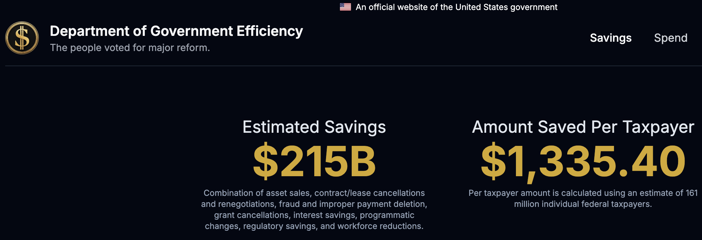
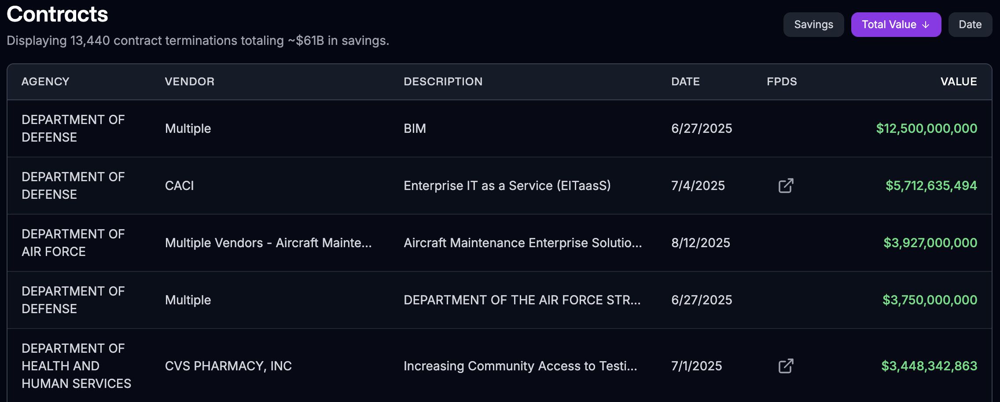

```{r setup, include=FALSE}
knitr::opts_chunk$set(
                      fig.width = 9, fig.height = 3.5, fig.retina = 3,
                      out.width = "100%",
                      cache = FALSE,
                      echo = TRUE,
                      message = FALSE, 
                      warning = FALSE,
                      hiline = TRUE
                      )
options(tinytex.verbose = TRUE)

library(ggplot2)
library(sf)
library(sp)
library(tidyverse)
library(gganimate)
library(transformr)
library(gifski)
library(ggthemes)
library(scales)
library(RColorBrewer)
library(kableExtra)
library(ggpubr)
library(rticles)
library(stats)
library(broom)
library(extrafont)
library(fixest)
library(modelsummary)
library(openxlsx)
library(raster)
library(lubridate)
library(png)
library(tibble)
library(knitr)
loadfonts()  

```


## Table of Contents

\large
1. Introduction 
2. Theory
3. Empirical Strategy 
4. Results
5. Conclusion 
6. Discussion


---

## 1. Introduction: Overview of the Research

- **RQ**: How does agency ideology shape the politics of federal contracting in the U.S.?

\medskip

- **Gap**: Existing studies focus on firms' political donations to the party in power \scriptsize{}\color{black!20} [@dahlstrom2021; @fazekasagency2023] \color{black}\normalsize{}

\medskip

- **Argument**: Those effects vary systematically across agencies. \color{blue} *Agency ideology* \color{black}\normalsize{} moderates the effects of firms' political donations on contract awards
  - \begingroup\scriptsize Agency ideology: Regulatory status; continuous, administration-specific president-agency distance\endgroup
  
\medskip

- **Mechanisms**: Ideological proximity between agencies and the president; Bureaucrats' discretion in contract awards

\medskip

- **Methodology**: OLS with fixed-effects; Logistic regression; Triple-differences design \begingroup\scriptsize(Difference-in-Differences-in-Differences, DDD)\endgroup


--- 

## Motivation: The DOGE Era (2025)

\begin{columns}[T] 
\column{.4\textwidth}
```{r dogeleft, fig.align="center", out.width = "100%", echo=FALSE}

```

\column{.6\textwidth}
```{r dogeright, fig.align="center", out.width = "100%", echo=FALSE}

```
\end{columns}

\vspace{0.5em}
\scriptsize{}\color{black!20} [@dogewebsite2025] \color{black}\normalsize{}


---

## 2. Theory

1. **Shared coalition incentives**: Ideologically aligned officials treat co-partisan donors as legitimate coalition partners \begingroup\scriptsize(e.g., trusted signals, deserving deference)\endgroup \scriptsize{}\color{black!20} [@hollibaugh2014; @witko2011] \color{black}\normalsize{}

\bigskip

2. **Reduced scrutiny under discretion**: Alignment lowers oversight of politically aligned contractors where procurement rules leave room for judgment \scriptsize{}\color{black!20} [@epstein1999; @hubershipan2002; @spenkuch2023] \color{black}\normalsize{}
  
  - *More discretion* $\rightarrow$ *larger favoritism effects*
  
\bigskip

3. **From alignment to institutional outcomes**: Aggregated micro-level deference shifts agency contracting outcomes toward favored firms
  
  - *Moderators*: Procurement discretion; appointee density; agency independence \scriptsize{}\color{black!20} [@lewis2008; @fazekasagency2023; @acsmapping2025] \color{black}\normalsize{}

---

## 3. Empirical Strategy: Hypotheses 

\begin{enumerate}

\item \textbf{H1}: \textcolor{blue}{\emph{Amplification}}: Ideological alignment between agencies and the president amplifies the effects of firms' political donations on contract awards

\bigskip

\item \textbf{H2}: \textcolor{blue}{\emph{Insulation}}: Ideological alignment between agencies and the president insulates officials from outside political pressures, reducing favoritism toward politically connected firms 

\bigskip

\item \textbf{H3}: \textcolor{blue}{\emph{Discretion}}: The moderating effects of agency ideology are stronger in regulatory agencies with higher levels of bureaucratic discretion in contract awards

\end{enumerate}


---

## Empirical Strategy: Summary

- **Goal**: Test whether agency ideology moderates the effects of firms' political donations on favoritism in the federal contracting
\medskip
- **Unit of analysis**: Contract-year
\medskip
- **Dependent variable**: Favored treatment in federal contracting (Favoritism Risk Index, FRI) \scriptsize{}\color{black!20} [@fazekasagency2023] \color{black}\normalsize{}
\medskip
- **Independent variable**: Political donations (donation indicator; log(donation amount))
\medskip
- **Moderating variable**: Regulatory indicator; continuous, administration-specific president-agency distance \scriptsize{}\color{black!20} [@acsmapping2025] \color{black}\normalsize{}
\medskip
- **Control/Fixed effects**: lagged firm revenue, contract-level characteristics / product type, state, agency, congressional term fixed effects

---

## Data

```{r datatable, fig.align="center", fig.pos="H",  out.width = "50%", message=FALSE, warning=FALSE, echo=FALSE}

data_tbl <- tribble(
  ~`Source`,          ~`What it gives`,                                  ~`Used for`,
  "USAspending.gov, Fazekas et al. (2023)", "Federal procurement contracts, 2004--2015",        "Contract-level FRI",
  "DIME, Bonica (2016)",            "Firm campaign donations, 2004--2015",              "Donation variables",
  "Acs (2025)",      "Dynamic agency ideal points, matched to Fazekas years", "President-agency distance",
  "Dahlström et al. (2021)", "Agency independence, regulatory status, controls", "Moderators and fixed effects"
)

data_tbl %>%
  kbl(booktabs = TRUE,
      linesep = "",
      align = c("l","l","l")) %>%
  kable_styling(latex_options = c("hold_position", "scale_down"), font_size = 8)

```

\vspace{0.5em}
\begingroup\scriptsize Bush = 2001--2009; Obama = 2009--2017. The @fazekasagency2023 sample covers 2004--2015.\endgroup

---

## Measure 1: Favoritism Risk Index (FRI) by Fazekas et al. (2023)

7 indicators of favoritism risk in federal contracting, measured at the contract-year level:

1. Single bidding
2. No publication
3. Non-competitive procedure type
4. Non-open solicitation type
5. Contract modifications
6. Supplier tax haven registration
7. Supplier debarred

---

## Measure 2: President-Agency Ideological Distance by Acs (2025)
```{r acstable, fig.align="center", fig.pos="H",  out.width = "50%", message=FALSE, warning=FALSE, echo=FALSE}

acs_tbl <- tribble(
  ~`Step`,          ~`Plain meaning`,                                  ~`Data / Output`,
  "Input data",       "Each planned federal regulation is one observation", "Unified Agenda + OIRA docket",
  "Observed signal",  "Did OIRA review the proposed rule?",              "Binary review indicator",
  "Model",            "IRT model estimates where each agency sits ideologically", "Agency ideal point by administration",
  "Scale anchor",     "Presidents anchor the ideology scale",            "Presidential NOMINATE scores",
  "Distance measure", "Absolute gap between president and agency",       "$|\\hat{\\theta}_{agency,t} - \\theta_{pres,t}|$",
  "Interpretation",   "Smaller distance means closer presidential-agency alignment", "Used as agency ideology moderator"
)

acs_tbl %>%
  kbl(booktabs = TRUE,
      escape = FALSE,
      linesep = "",
      align = c("l","l","l")) %>%
  kable_styling(latex_options = c("hold_position", "scale_down"), font_size = 8)

```

---

## Measure 3: Regulatory Status

```{r regtable, fig.align="center", fig.pos="H",  out.width = "50%", message=FALSE, warning=FALSE, echo=FALSE}

reg_tbl <- tribble(
  ~`Matching step`,          ~`Count`,      ~`Role in final indicator`,
  "Fazekas et al. (2023) agencies",       "175",         "Agency universe",
  "Strict Acs (2025) matches",     "37",          "Direct regulatory match",
  "Broad-only rulemaking matches", "57",   "Federal Register rulemaking match",
  "Fuzzy candidates",       "8",           "Name-cleaning check",
  "Final regulatory agencies", "102",      "Regulatory = 1",
  "Regulatory contract observations", "42.7 percent", "Share of contracts"
)

reg_tbl %>%
  kbl(booktabs = TRUE,
      linesep = "",
      align = c("l","l","l")) %>%
  kable_styling(latex_options = c("hold_position", "scale_down"), font_size = 8)

```

\vspace{0.5em}
\begingroup\scriptsize Final binary indicator combines strict Acs (2025) matches, broad Federal Register rulemaking matches, and fuzzy name checks. 1 = regulatory; 0 = non-regulatory.\endgroup

---

## Equation 1: Main Model Specification

$$
Y_{iat} = \beta_1 D_{it} + \beta_2 (D_{it} \times \text{Ideology}_{at}) + \beta_3 \text{Ideology}_{at} + \mathbf{X}_{iat}'\gamma + \mu_f + \mu_p + \mu_s + \mu_c + \varepsilon_{iat}
$$ 

\bigskip

- $Y_{iat}$: Favoritism Risk Index (FRI) for contract $i$ with agency $a$ in year $t$

- $D_{it}$: donation variable

- $\text{Ideology}_{at}$: agency ideology (regulatory status; continuous, administration-specific president-agency distance)

- $\mu_f$, $\mu_p$, $\mu_s$, and $\mu_c$: firm, product category, state, and congressional term fixed effects \scriptsize{}\color{black!20} [@fazekasagency2023] \color{black}\normalsize{}   

- Standard errors: clustered at the firm and congressional term levels

---

## Equation 2: Logistic Regression

The logistic regression of donation probability on ideological distance:

$$
\operatorname{Pr}(\texttt{isDonation}_{ift} = 1) = \operatorname{logit}^{-1}(\alpha + \beta \cdot \texttt{distance}_{at} + \pi_a)
$$ 

\bigskip

- $\texttt{isDonation}_{ift}$: an indicator variable equal to 1 if firm $f$ donates to the president's party in year $t$ and 0 otherwise

- $\texttt{distance}_{at}$: the absolute ideological distance between the president and agency $a$ in year $t$ \scriptsize{}\color{black!20} [@acsmapping2025] \color{black}\normalsize{}

- $\beta$: coefficient captures how the probability of donation changes with the ideological distance

- $\pi_a$: agency fixed effect 

---

## 4. Results: Regulatory Status as Agency Ideology (Table 2)

```{r resulttab2, fig.align="center", fig.pos="H", out.width="70%", message=FALSE, warning=FALSE, echo=FALSE}

table2_tbl <- tribble(
  ~`Term`, ~`(1)`, ~`(2)`, ~`(3)`, ~`(4)`, ~`(5)`,
  "Donation dummy x Regulatory", "0.046", "", "", "", "",
  "Log donation x Regulatory", "", "0.004", "", "", "",
  "Med. donation x Regulatory", "", "", "0.070+", "", "",
  "Large donation x Regulatory", "", "", "-0.013", "", "",
  "Log donation to majority x Regulatory", "", "", "", "0.004", "",
  "Med. donation to majority x Regulatory", "", "", "", "", "0.075*",
  "Large donation to majority x Regulatory", "", "", "", "", "-0.032",
  "Num. Obs.", "440,987", "440,987", "440,987", "440,987", "440,987",
  "$R^2$", "0.317", "0.318", "0.317", "0.317", "0.317"
)

table2_tbl %>%
  kbl(booktabs = TRUE,
      escape = FALSE,
      linesep = "",
      align = c("l","c","c","c","c","c")) %>%
  kable_styling(latex_options = c("hold_position", "scale_down"), font_size = 7) %>%
  add_header_above(c(" " = 1, "Favoritism Risk Index (FRI)" = 5)) %>%
  row_spec(7, extra_latex_after = "\\midrule")

```

\vspace{-0.4em}
\begingroup\scriptsize + p \textless{} 0.10; * p \textless{} 0.05; ** p \textless{} 0.01; *** p \textless{} 0.001\endgroup

---

## Lagged Revenue Control (Table 3)

```{r resulttab3, fig.align="center", fig.pos="H", out.width="70%", message=FALSE, warning=FALSE, echo=FALSE}

table3_tbl <- tribble(
  ~`Term`, ~`(1)`, ~`(2)`, ~`(3)`, ~`(4)`, ~`(5)`,
  "Donation dummy x Regulatory", "0.064*", "", "", "", "",
  "Log donation x Regulatory", "", "0.005+", "", "", "",
  "Med. donation x Regulatory", "", "", "0.088+", "", "",
  "Large donation x Regulatory", "", "", "0.006", "", "",
  "Log donation to majority x Regulatory", "", "", "", "0.005+", "",
  "Med. donation to majority x Regulatory", "", "", "", "", "0.088*",
  "Large donation to majority x Regulatory", "", "", "", "", "-0.008",
  "Num. Obs.", "343,275", "343,275", "343,275", "343,275", "343,275",
  "$R^2$", "0.339", "0.339", "0.339", "0.339", "0.339"
)

table3_tbl %>%
  kbl(booktabs = TRUE,
      escape = FALSE,
      linesep = "",
      align = c("l","c","c","c","c","c")) %>%
  kable_styling(latex_options = c("hold_position", "scale_down"), font_size = 7) %>%
  add_header_above(c(" " = 1, "Favoritism Risk Index (FRI)" = 5)) %>%
  row_spec(7, extra_latex_after = "\\midrule")

```

\vspace{-0.4em}
\begingroup\scriptsize + p \textless{} 0.10; * p \textless{} 0.05; ** p \textless{} 0.01; *** p \textless{} 0.001\endgroup

---

## Log Donation Effects on FRI (Figure 1)

```{r result-figure1, fig.align="center", out.width="82%", message=FALSE, warning=FALSE, echo=FALSE}
knitr::include_graphics("../../fazekas-ferrali-wachs-2023-jpart/results/figure/f4extregfinal.png")
```

---

## DDD Design (Table 4)

```{r resulttab4, fig.align="center", fig.pos="H", out.width="70%", message=FALSE, warning=FALSE, echo=FALSE}

table4_tbl <- tribble(
  ~`Term`, ~`(1)`, ~`(2)`,
  "Donation dummy x Regulatory x Dem. presidency", "0.125**", "",
  "Log donation x Regulatory x Dem. presidency", "", "0.011*",
  "Num. Obs.", "440,987", "440,987",
  "$R^2$", "0.317", "0.318"
)

table4_tbl %>%
  kbl(booktabs = TRUE,
      escape = FALSE,
      linesep = "",
      align = c("l","c","c")) %>%
  kable_styling(latex_options = c("hold_position", "scale_down"), font_size = 8) %>%
  add_header_above(c(" " = 1, "Favoritism Risk Index (FRI)" = 2)) %>%
  row_spec(2, extra_latex_after = "\\midrule")

```

\vspace{-0.4em}
\begingroup\scriptsize + p \textless{} 0.10; * p \textless{} 0.05; ** p \textless{} 0.01; *** p \textless{} 0.001\endgroup

---

## Donation Probability by President-Agency Distance (Figure 2)

```{r resultfig2, fig.align="center", out.width="70%", message=FALSE, warning=FALSE, echo=FALSE}
knitr::include_graphics("../../acs-2025-apsr/results/figure/ext1logitplot.png")
```

---

## 5. Conclusion: Expected Contributions

- **Theoretical contribution**:
  - Connect the regulatory-state literature with the procurement favoritism literature
  - Show how agency ideology can condition the returns to political donations \scriptsize{}\color{black!20} [@acsmapping2025; @fazekasagency2023] \color{black}\normalsize{}

\bigskip

- **Empirical contribution**:
  - Use dynamic agency ideal points from Acs (2025) in a federal contracting setting
  - Add regulatory status and DDD tests to the Fazekas et al. (2023) framework 

\bigskip

- **Implications**:
  - Presidential-agency alignment may increase responsiveness, but also donor-linked favoritism risk
  - The risk appears most visible where agencies have regulatory discretion


---

## Conclusion: Methodological Takeaways

- **Measurement strategy**:
  - Treat agency ideology as a moderator, not only as a background institution
  - Use both regulatory status and continuous, administration-specific president-agency distance \scriptsize{}\color{black!20} [@acsmapping2025; @fazekasagency2023] \color{black}\normalsize{}

\bigskip

- **Modeling strategy**:
  - Use interaction models for donation-linked favoritism
  - Use DDD to test whether regulatory status matters differently across presidential-party periods

\bigskip

- **Validation strategy**:
  - Check whether the Acs-based measure travels from regulatory output to procurement outcomes
  - Use distributional diagnostics to justify count-model choices


---

## 6. Discussion: Limitations \& Future Directions

- **Measurement limitations:** 
  - FRI measures procedural risk, not directly observed favoritism \scriptsize{}\color{black!20} [@fazekasagency2023] \color{black}\normalsize{}
  - President-agency distance is estimated and its uncertainty is not fully propagated \scriptsize{}\color{black!20} [@acsmapping2025] \color{black}\normalsize{}
  
\smallskip

- **Sample limitations:**  
  - The merged contracting sample covers 2004--2015
  - The design mainly compares the Bush and Obama administrations
  
\smallskip

- **Mechanisms:**  
  - Future work could separate ideology from appointee density, mission, and procurement-officer discretion

\smallskip

- **Future directions:**  
  - Test heterogeneity by agency function, racial/ethnic diversity of agencies, industry, and firm size
  - Use transition/event-study designs around presidential turnover


---

## Thank you!

Amplification or Insulation? Estimating the Role of Agency Ideology in Donation-Linked Favoritism in U.S. Federal Contracting

\begin{itemize}
\item \href{mailto:jodypark@psu.edu}{Jody Park, 1st-year PhD Student in Political Science \& Social Data Analytics, Penn State}
\end{itemize}

---

## Appendix. Figure 1

Posterior Predictive Check: Proportion of Zeros in Poisson vs. Negative Binomial Replications

```{r appendix-fig-c2, fig.align="center", out.width="63%", message=FALSE, warning=FALSE, echo=FALSE}
knitr::include_graphics("../../acs-2025-apsr/results/figure/ext2ppc.png")
```

\vspace{0.5em}
\scriptsize{}\color{black!20} Dashed line: observed proportion of zeros in the ACS (2025) data \color{black}\normalsize{}


---

## Appendix. Table 1

```{r appendix-table-c9, results="asis", message=FALSE, warning=FALSE, echo=FALSE}
cat("\\input{../../fazekas-ferrali-wachs-2023-jpart/results/table/regulatorymatch_1.tex}\n")
```

---

## Appendix. Table 2

```{r appendix-table-c13, results="asis", message=FALSE, warning=FALSE, echo=FALSE}
cat("\\input{../../fazekas-ferrali-wachs-2023-jpart/results/table/regfinalmatch.tex}\n")
```


---

## References {.allowframebreaks}

\footnotesize

::: {#refs}
:::
